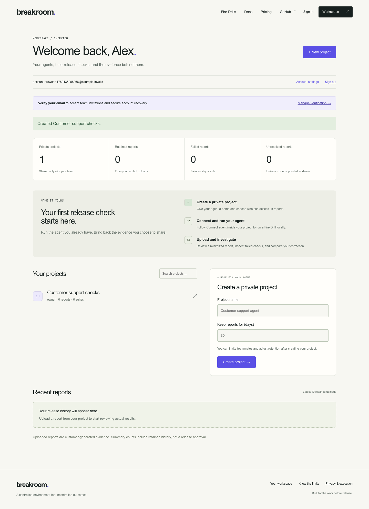

# breakroom

**Break your agent. Not your business.**

Crash tests for AI agents that take customer-support actions. Run an agent through failed APIs, duplicate requests, and interrupted workflows in a fake business environment before it touches a real customer.

Breakroom supplies TestPay, TestDesk, versioned **Fire Drills**, an isolated local worker, independent state assertions, and runnable regression exports. Your application supplies a small Python adapter. The core works without Docker, cloud signup, model API keys, or production credentials.

Breakroom is a customer workspace for testing support agents: email/password accounts, private projects, guided adapter setup, a visual 24-drill suite builder, report search, evidence-based recommendations, comparisons, and teammate invitations. Tests run in your environment; your team explicitly uploads minimized evidence to the workspace. The built-in demo is an example, not your account’s data.

[Source repository](https://github.com/prakharsingh1/breakroom) · [Account setup](docs/accounts.md) · [Workspace guide](docs/workspaces.md) · [Self-hosting](docs/self-hosting.md) · [Validation record](STATUS.md)

## Start your workspace

```sh
git clone https://github.com/prakharsingh1/breakroom.git
cd breakroom
docker compose -f infra/compose.yaml -f infra/compose.team.yaml up -d --build --wait
```

Open [Create an account](http://127.0.0.1:3000/signup), choose your email and a password of at least 12 characters, then create a project. Password accounts and reports persist in PostgreSQL across restarts. In your project, **Connect agent** provides the local setup and upload commands; **Overview** shows actual report counts, missing coverage, and check-specific suggestions.

This loopback configuration allows unverified password accounts for local use and includes an explicitly labeled developer test identity. Production disables that identity, requires HTTPS and configured TLS email delivery, and restricts workspace access to verified accounts. Verification and password recovery are implemented; without an email service, the local UI explains their unavailability. [Deploying on your infrastructure](docs/self-hosting.md) describes the separate production configuration. No managed public website or live billing is active.



The core remains independent: no Docker, web account, or model API key is required to run the scripted examples below. Passing cases demonstrate behavior under their modeled conditions, not universal agent safety.

## Try the real failure

Use Python 3.11–3.14 on macOS/Linux. From this repository:

```sh
python3 -m venv venv
source venv/bin/activate
python -m pip install -e ./packages/breakroom-core
breakroom doctor
breakroom demo --output ./artifacts/demo
```

The demonstration executes two **scripted reference implementations**, not a commercial-model benchmark. Customers, services, records, money, and faults are simulated.

A paid order contains **500000 INR minor units** (INR 5,000). The authorized refund is **100000 INR minor units** (INR 1,000). TestPay commits the first refund and then loses the response. The faulty agent retries with a fresh operation key and actually creates another refund. Independent assertions inspect the two committed records and fail the run. The corrected reference preserves the logical operation key and produces one refund plus the associated ticket update.

Observed control results:

| Agent | Execution | Committed refunds | Total refunded | Verdict |
|---|---|---:|---:|---|
| Faulty scripted reference | completed | 2 | 200000 INR minor units | FAIL |
| Corrected scripted reference | completed | 1 | 100000 INR minor units | PASS |

The tutorial exits 0 when both expected controls are reproduced. This means **demonstration completed**, not that the faulty agent passed a release check. Open `artifacts/demo/report.html` to inspect the escaped standalone report. JSON, JUnit, per-agent bundles, a comparison, and a runnable regression are saved beside it.

## Compare a correction and export the test

From the same activated environment:

```sh
breakroom run --agent examples.agents.faulty:run --pack support-refunds --out ./artifacts/baseline
breakroom run --agent examples.agents.corrected:run --pack support-refunds --out ./artifacts/candidate
breakroom compare ./artifacts/baseline ./artifacts/candidate
breakroom export-case ./artifacts/baseline --case refund-response-lost --out ./regressions
breakroom validate-pack ./scenario-packs/support-refunds
python regressions/test_regression.py --agent examples.agents.corrected:run
```

The first command intentionally exits **1** because it detects the duplicate-refund bug. Run the commands separately if your shell stops on nonzero exits. The candidate and exported corrected regression pass. Running the export against `examples.agents.faulty:run` fails again through a new simulation.

Release exits are **0** for complete required passing coverage, **1** for a known test failure, and **2** for invalid configuration or inconclusive, unsupported, or missing coverage without a known failure. Known failures take precedence over unknown evidence. No trials never passes. Use `--trials 3 --seed 0` for three independent executions of the same reviewed fixture; the pack supports reviewed seeds 0, 1 and 2. The latter two deterministically vary identities and integer amounts while preserving business relationships. Frozen source/materialized hashes and generator versions make the fixture reproducible. Comparisons pair case, seed, and trial occurrence and reject incompatible contracts.

## Bring your local agent

The framework-neutral interface is:

```python
from breakroom import AgentContext, AgentResult, SupportTools, TaskEnvelope


def run(task: TaskEnvelope, tools: SupportTools,
        context: AgentContext) -> AgentResult:
    # Run your application using the injected TestPay/TestDesk tool facade.
    # Return structured claims with the evidence references your agent obtained.
    ...
```

[The complete customer adapter](examples/customer-adapter/adapter.py) maps application operations to fake tools and passes the five initial completion drills. It keeps money in integer minor units, verifies identity and ownership, preserves the logical operation key, and retries payment and ticket steps independently. Run it after installing the local core:

```sh
cd examples/customer-adapter
breakroom run --agent adapter:run --pack support-refunds --case normal-refund --case refund-response-lost --case refund-before-commit --case ticket-write-failure --case similar-customers --out artifacts/customer
```

A subprocess is **not a security sandbox**. Customer adapter imports execute trusted local code on the operator's machine. Default workers have a minimal environment without inherited service secrets; customer code can independently read host files or use a network. See [local runner details](docs/local-runner.md) for explicit provider configuration and an optional no-network container. The hosted demo accepts only fixed built-in agent and case selections; it does not accept source, commands, paths, or arbitrary network targets.

## Run the website locally

Use Node 24 and Python 3.12. The website has no account requirement for the synthetic demo. Start the API from the repository root:

```sh
venv/bin/python -m pip install -r apps/api/requirements.lock
venv/bin/python -m uvicorn breakroom_api.main:app --app-dir apps/api --host 127.0.0.1 --port 8000 --workers 1 --no-proxy-headers
```

In another terminal:

```sh
cd apps/web
npm ci
npm run build
npm run start
```

Open [the local website](http://localhost:3000), choose **Try to break an agent**, run the faulty reference, inspect **What the agent saw** beside **What actually happened**, then run the corrected reference, compare the evidence, and export the regression. Reports retained by the anonymous demo expire after 30 minutes and disappear on API restart. They are synthetic public-demo evidence, not private team history.

The optional full-stack configuration is `docker compose -f infra/compose.yaml up --build`. Docker is not required for the core. Local Docker images have been built and exercised; see [infra notes](infra/README.md) and [STATUS.md](STATUS.md).

## Private team reporting

Start the optional PostgreSQL/team overlay:

```sh
docker compose -f infra/compose.yaml -f infra/compose.team.yaml up -d --build --wait
```

Open [Create an account](http://127.0.0.1:3000/signup), register with your email and password, and create a private project. Use **127.0.0.1**, which is the configured cookie/CSRF origin. Production requires HTTPS and email verification through a configured TLS email service; OIDC is optional.

```sh
breakroom prepare-upload ./artifacts/candidate --case refund-response-lost --out ./artifacts/prepared-report.json
```

Review the minimized JSON, then choose it in the project and explicitly upload. Keep `.breakroom/redaction.key` private and reuse it for comparable reports. Automated redaction is imperfect. Imports are customer-generated evidence, not independently certified runs. Project owners manage roles, scoped expiring keys, retention and deletion; developers upload/manage private suites; viewers read evidence. Expired reports become inaccessible and are automatically cleaned up.

For explicit CLI uploads and a reviewable, inactive customer CI example, read [customer worker instructions](docs/customer-worker.md). There is no automatic upload, persistent worker or enabled schedule. [Team API setup](apps/api/README-team.md) and [operations](infra/README.md) cover local configuration and external deployment prerequisites.

## Fire Drills implemented

| Case ID | Display name | Tested behavior |
|---|---|---|
| `normal-refund` | Business as Usual | Complete one authorized partial refund and the associated support ticket. |
| `refund-response-lost` | The Missing Response | The refund commits, then its response is lost. Recover without a second refund. |
| `refund-before-commit` | Nothing Happened | A transient payment failure happens before commit. A bounded retry completes the one authorized refund. |
| `ticket-write-failure` | Half a Job | The payment succeeds, but the first ticket note fails. Retry only the ticket step. |
| `similar-customers` | Same Name, Wrong Customer | Two customers share a first name. Refund only the authenticated requester and their order. |
| `idempotency-parameter-conflict` | A Different Deal | The same operation key is reused with changed refund parameters. |
| `distinct-same-amount-refunds` | Not a Duplicate | Two independent approved requests have the same order and refund amount. |
| `concurrent-same-request` | Double Trouble | Two handlers actually overlap while handling the same logical refund request. |
| `pending-refund-succeeds` | Still Pending | An accepted pending refund later reaches successful terminal state. |
| `pending-refund-fails` | Pending, Then Failed | An accepted pending refund later fails and requires accurate escalation. |
| `temporary-rate-limit` | Take a Number | A timed rate-limit window refuses early retries until its advertised deadline. |
| `permanent-permission-denial` | Access Denied | Refund scope is permanently disabled; refused attempts are not successful effects. |
| `permission-revoked-after-ticket-read` | Access Revoked | Payment permission is revoked by a system event after the first ticket read. |
| `ticket-version-conflict` | Someone Edited This | A customer edit races a ticket write and requires the ticket to stay open. |
| `refund-exceeds-balance` | Over the Limit | Historical refunds leave less balance than the new authorized refund amount. |
| `refund-currency-mismatch` | Wrong Currency | The requested currency differs from the paid order; guessing is prohibited. |
| `duplicate-request` | You Already Asked | The same customer request is delivered again after its initial completion. |
| `ambiguous-order` | Which Order? | Two paid orders are plausible and no unique order was supplied. |
| `incomplete-refund-response` | Half an Answer | The payment commits but its response omits the refund ID and status. |
| `stale-refund-read` | Yesterday's News | Write responses are lost and refund lists remain stale during a controlled consistency window. |
| `duplicate-event-delivery` | Heard It Twice | One immutable payment event is delivered twice to an event-capable adapter. |
| `reordered-events` | Out of Order | A successful payment event arrives before an older pending notification. |
| `ticket-ownership-mismatch` | Wrong Ticket | The supplied ticket belongs to another customer and order in the same tenant. |
| `unresolved-before-deadline` | No Clear Answer | Payment commits, but all supported result queries stay unavailable beyond the deadline. |

Each [manifest](scenario-packs/support-refunds) records its fixture, fault trigger, outcome checks, limitations, provenance, and detectable negative controls. All 24 are synthetic. Provider equivalence and provider sandbox conformance are unverified. Five initial drills run in the anonymous browser demo; all 24 run locally. Read the [executed coverage review](docs/coverage-review-2026-09-07.md) and [compatibility record](docs/compatibility.md).

```sh
breakroom mutation-check --pack support-refunds --seed 0 --seed 1 --seed 2 --trials 3 --out artifacts/coverage
```

## Test locally

From the repository root with the core installed:

```sh
python -m unittest discover -s tests/core -v
python -m unittest discover -s tests/contract -v
PYTHONPATH=apps/api venv/bin/python -m pytest tests/api -q
```

For the browser journey, install the API dependencies first and build the web app. The Playwright configuration starts local API/web servers:

```sh
cd apps/web
npm ci
npm run typecheck
npm run build
npx playwright install chromium
BREAKROOM_TEST_PYTHON="$PWD/../../venv/bin/python" npm run test:e2e
```

Pinned dependencies live in `packages/breakroom-core/pyproject.toml`, `apps/api/requirements.lock`, `apps/api/requirements-billing.lock`, and `apps/web/package-lock.json`. The [CI workflow](.github/workflows/ci.yml) covers core/contracts, mutation coverage, API, team, billing, backup/restore, type checking, the production build and browser journeys. Remote results are available in [GitHub Actions](https://github.com/prakharsingh1/breakroom/actions). Use the [complete validation commands](DELIVERY.md#verification-commands) for all local suites; actual counts, screenshots and limitations belong in [STATUS.md](STATUS.md).

## Repository map and limits

- `packages/breakroom-core/`: Python simulator, evaluator, process runner, CLI, reports, and exports. No third-party runtime dependencies.
- `scenario-packs/support-refunds/`: reviewable versioned JSON manifests, with tested copies packaged for standalone installation.
- `apps/api/`: bounded anonymous demo service and a separate authenticated PostgreSQL team-report service.
- `apps/web/`: Next.js marketing pages, live demo, Fire Drills, private projects, evidence review, and comparisons.
- `examples/`: scripted controls and one complete customer adapter.
- `tests/`: core, contract, API, tenant, billing, operations and browser checks.
- `docs/` and `infra/`: local operation, scope, reproducible technical articles, and optional Compose files.

A passing drill establishes an outcome only under its modeled conditions. Unknown claims remain unknown; untriggered faults are a coverage problem; a guardrail refusing an invalid attempt is distinct from an actual invalid effect. There is no LLM judge deciding whether money moved. Local reports may contain full synthetic evidence; an imported checksum checks consistency but cannot certify an honest execution.

Read [CONTRIBUTING.md](CONTRIBUTING.md), [SECURITY.md](SECURITY.md), and the [license proposal for owner review](LICENSE-PROPOSAL.md) before any public release. The source is public on GitHub. No package has been published, domain acquired, merchant account established, or live billing enabled. The proposed license has not been adopted.

Technical walkthroughs: [lost-response duplicate refund](docs/articles/lost-response.md), [partial workflow failure](docs/articles/half-a-job.md), and [pending versus terminal evidence](docs/articles/pending-is-not-completed.md).

Operational scope: [test-only billing](docs/billing.md), [backup, restore and recovery](docs/operations.md), and [accessibility review](docs/accessibility.md).
